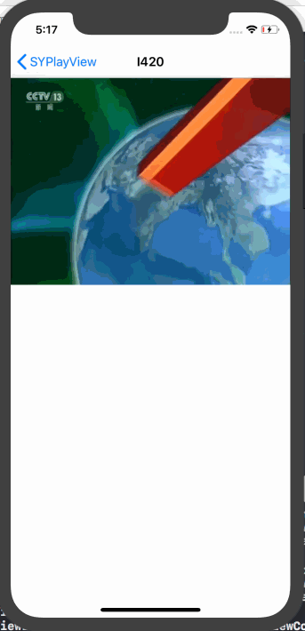
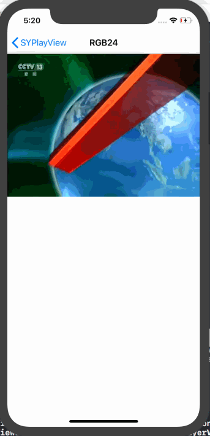

# SYPlayView
> 使用 `OpenGL` 渲染视频数据。

## 更新
### 【2018-06-24】
1. 添加 `RGB24` 格式视频播放。

### 【2018-06-19】
1. 渲染播放 `I420` 格式视频。
2. 支持捏合放大、缩小；平移画面操作。
3. 支持自动横屏全屏。

##  视频文件
Demo 视频文件已分享至 [百度云盘](https://pan.baidu.com/s/1brLSNaz6BL-CRHBBj5w_uw)，提取码是：**`r974 `**。