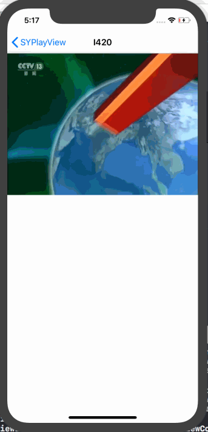
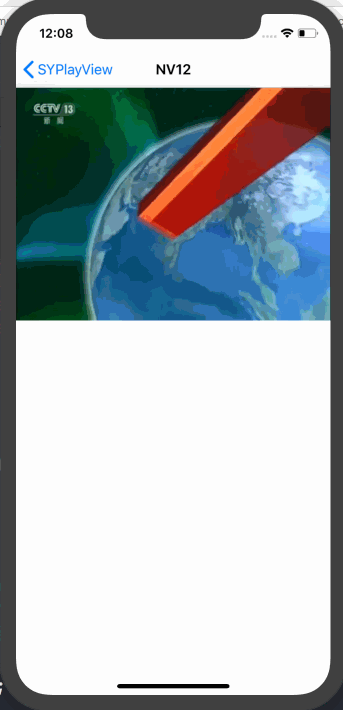
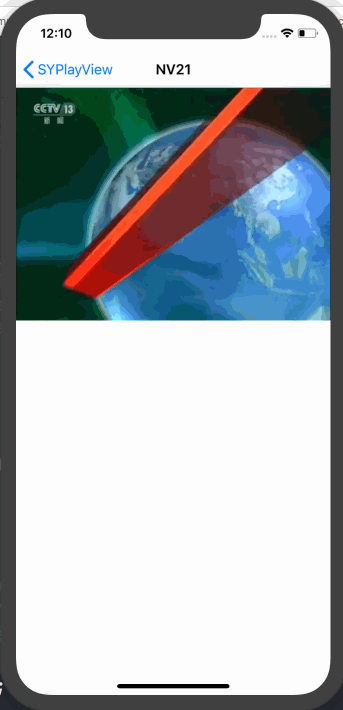
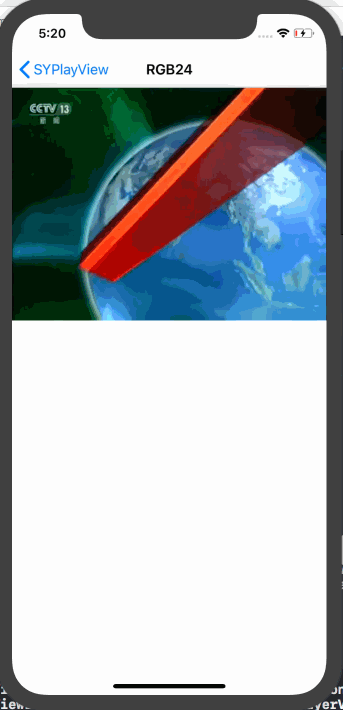
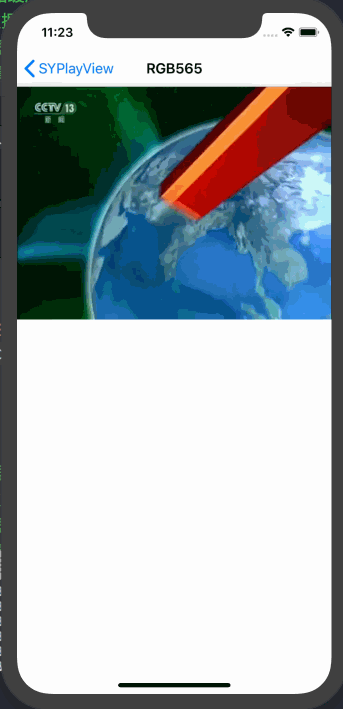

# SYPlayView
> 使用 `OpenGL` 渲染视频数据。

1. 渲染播放 `I420`

	
2. 渲染播放 `NV12`

	
3. 渲染播放 `NV21`

	
4. 渲染播放 `RGB24`

	
5. 渲染播放 `RGB565`

	

## 更新
### 【2018-07-10】
1. 添加 `RGB565` 格式视频播放。

### 【2018-06-25】
1. 添加 `NV12` 和 `NV21` 格式视频播放。

### 【2018-06-24】
1. 添加 `RGB24` 格式视频播放。

### 【2018-06-19】
1. 渲染播放 `I420` 格式视频。
2. 支持捏合放大、缩小；平移画面操作。
3. 支持自动横屏全屏。

##  视频文件
Demo 视频文件已分享至 [百度云盘](https://pan.baidu.com/s/1LfT8Sawu7rdphW6yQwZu5A)，提取码：**`15da `**。